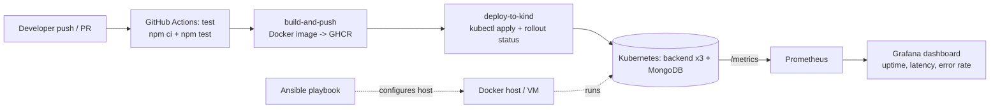

# Pipeline Diagram

```mermaid
flowchart LR
  A[Developer push / PR] --> B[GitHub Actions: test<br/>npm ci + npm test]
  B --> C[build-and-push<br/>Docker image -> GHCR]
  C --> D[deploy-to-kind<br/>kubectl apply + rollout status]
  D --> E[(Kubernetes: backend x3 + MongoDB)]
  E -->|/metrics| F[Prometheus]
  F --> G[Grafana dashboard<br/>uptime, latency, error rate]
  H[Ansible playbook] -.configures host.-> I[Docker host / VM]
  I -.runs.-> E
```
Export as PNG: paste the block into https://mermaid.live and download (save as docs/pipeline-diagram.png).
